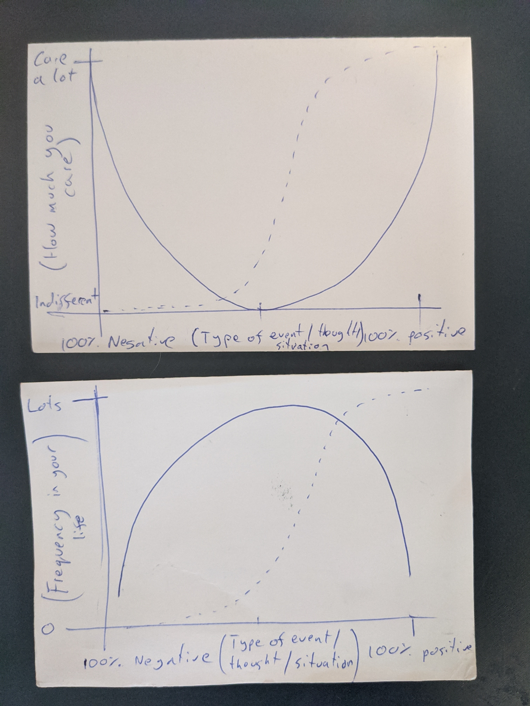

# How to enjoy life

- Reduce effect of negative events/situations/thoughts
- Increase the effect of positive events/situations/thoughts
- Reduce frequency of negative events/situations/thoughts
- Increase frequency of positive events/situations/thoughts

The solid lines are the norm. Dotted line is what you want to work towards.

How:

- Learn to accept and embrace everything that happens to you
  - The most important aspect. As you can't control everything that happens to you. All you can do about it is develop the way you think about it so negative events don't make you sad. But not doing this for positive events, let positive events fill you with joy.
-
