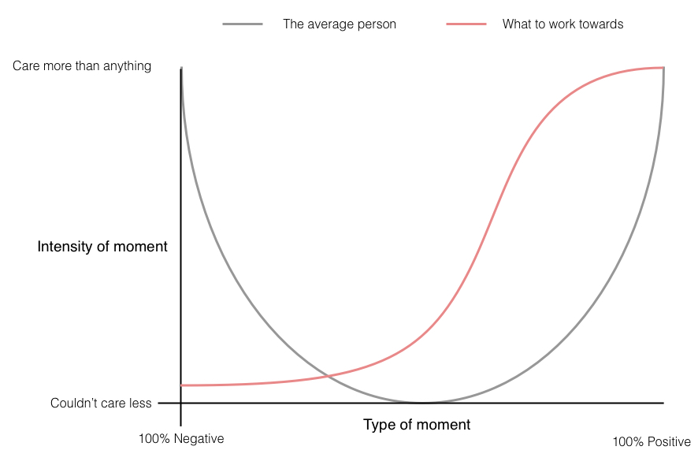
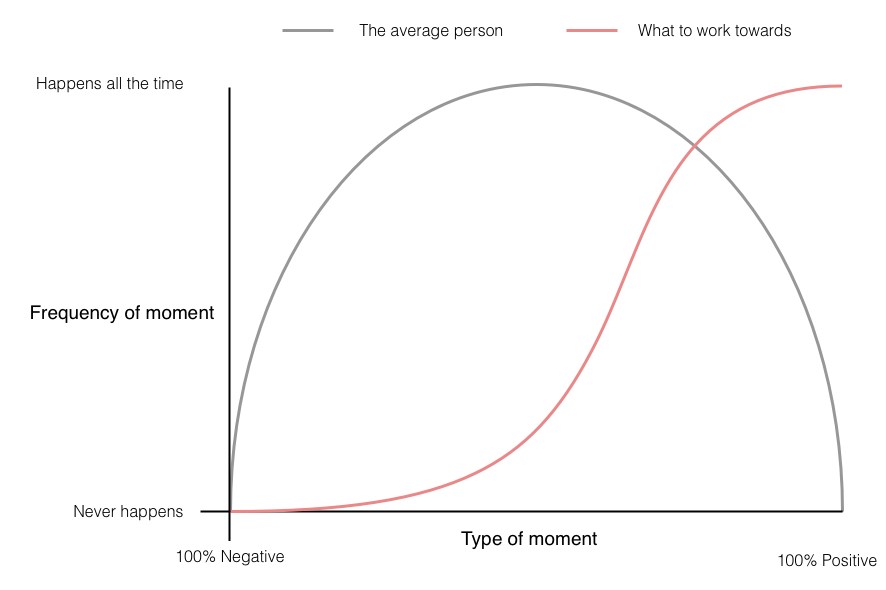

# How to enjoy life

Trying to live the most enjoyable 🥳 life you can seems like a pretty reasonable goal to have. Not much seems more important.

> Although if your life goal is to figure out how to take 600 million year old animal DNA, revive ancient creatures and create an island based theme park around them, I am fully on board with you ☠️🏃‍♂️🦖🦕

Anyhoo, if you're thinking "Wait a minute, helping others is more important than enjoying your own life. Charlie you're a dick 🍆". I do include adhering to your own moral codes within what makes you enjoy life. Don't worry I got you covered 👍.

You can look at any event/situation/thought or feeling (we're going to combine these in the word "moments") in terms of how positive 👍 or negative 👎 it is towards helping you enjoy life. (Yeah, glossing over lot's of detail here short/long term enjoyment etc but I've got a word count 📖 to stick to). With this in mind I see 2 prime ways to improve how you enjoy life:

- Increase 📈 the frequency and intensity of positive moments
- Decrease 📉 the frequency and intensity of negative moments

By intensity, I'm talking about how much that moment effects you. For example, negative moments occurring to you are not that bad if they have a small impact on how you feel.

Here's 2 handy bitesize graphs showing you how I'd imagine the average person experiences positive and negative moments and the red lines show what I think we should be working towards.

The first graph is arguably the more important one. We have more control over how we think about moments than how often they occur, as frequency can often be dependant on external factors (out of your control), whereas your own feelings and thought process are internal and can be developed (more inside your control).

To help reduce the impact of negative moments on your feelings. I turn to a mix of Stoic advice and mindfulness 🧠. Which (through practice e.g. meditation) encourages you to accept the current moment without judging it and to visualise potential negative situations to train your mind to deal with negative experiences. Checkout [A Guide to the Good Life: The Ancient Art of Stoic Joy ](https://www.amazon.co.uk/Guide-Good-Life-Ancient-Stoic-ebook/dp/B0040JHNQG/ref=tmm_kin_swatch_0?_encoding=UTF8&qid=&sr=)and the meditation app [Calm](https://www.calm.com/). Great places to start.

For positive moments learn to fully let yourself absorb into the experience and joy 😀 of it. Keeping you mind in the present during these moments let you take full advantage of it.

When it comes to balancing the frequency of positive and negative events you can do stuff to improve it, but it's still more out of your control:

- Identify habits and behaviours that lead to negative short or long term moments in your life, and develop new habits and behaviours to combat them. (Research "Habit Forming" for more on this)
- Specifically write 📝 down things you enjoy and don't enjoy, the process of specifically writing them down helps solidify in your head what to do more or less of
- Try new things to learn more about what works or doesn't work for you. I look at life as a bunch of experiments 🧪🔬 to help optimise your happiness. Make the leap and try that new thing, your past life is still there to fallback on if you want.

The perfect life is a balance of positive and negative experiences, we're not removing negative experiences, just adjusting their power and how often they occur. Essentially pushing up the bar on your life.
