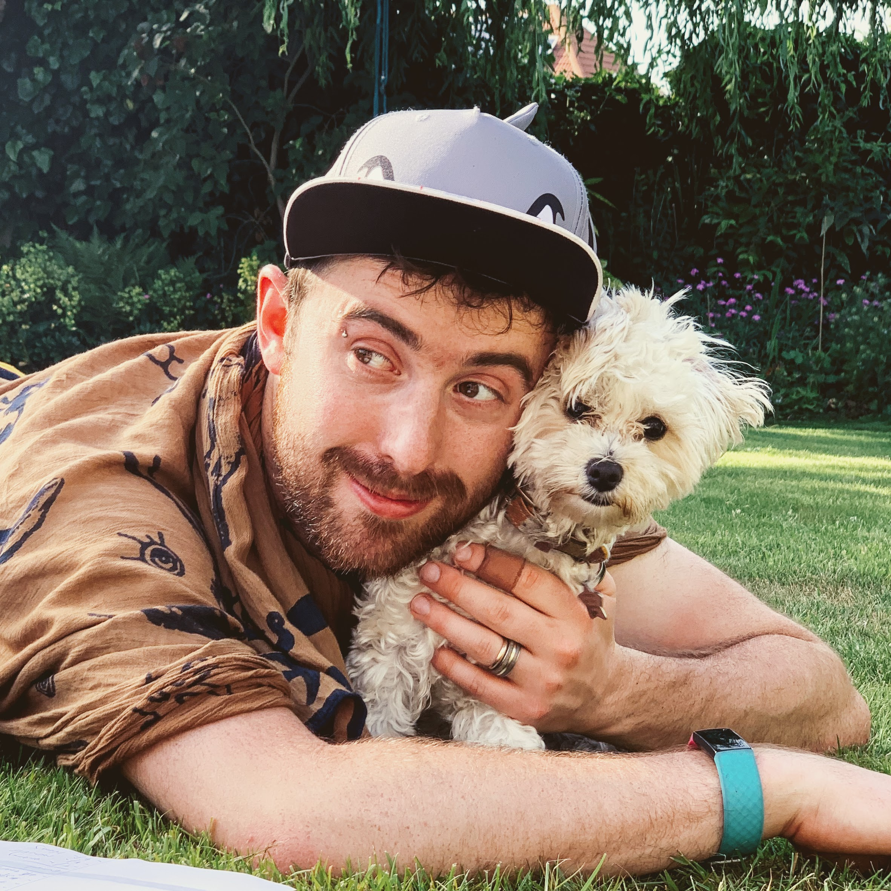

# Killing the Dog - My new reason for practicing mindfulness

Anyone else seriously wanted to kill their dog ☠️🐶? And gone through a bunch of plans to make it seem like an accident?

- "Accidentally" leaving the front door open so she runs into the road
- Hosting a house party 🥳, putting on "Who let the dogs out", turning the music up and putting the puppy in the middle of the dance floor until someone crushes her to death with their funky moves
- Traveling back to the Roman times, telling everyone the dog is the Messiah and waiting until the inevitable crucifixion ✟

Yeah, I thought about this. In the first few weeks of getting the most adorable little puppy I found myself in a permanent state where I couldn't think clearly for the first time in my life. Possibly due to a mixture of sleep deprivation, constant distraction, worrying and spending too many hours surfing the net for cute little doggy outfits 😉

Either way it scared the shit 💩 out of me, and I became super unhappy. To a point where I was seriously considering how to kill the dog and make it look like an accident.

It made me sympathise more with people who are aware that they are losing their minds. And having lost my Grandma to Alzheimers a year or so before, the scary reality of this problem was very prominent in my mind.

So I've been wondering about how you could prepare yourself to better deal with future situations where you can't think clearly. And have a theory for ya'll:

> Establishing a strong habit for meditation and other mindfulness techniques will increase your happiness and ability to cope when being in a situation or developing a condition that prevents you from thinking normally.

Mindfulness is about living in the present moment and accepting how you're feeling. Which should help you cope with a situation where you can't think clearly. The problem is deciding to or being able to practice mindfulness when in this state. Which is why it would need to be developed as a life long habit that starts to enter your subconscious.

Just a fun light thought for you all 🙃.

P.s. I love my dog ♥ 🐶

