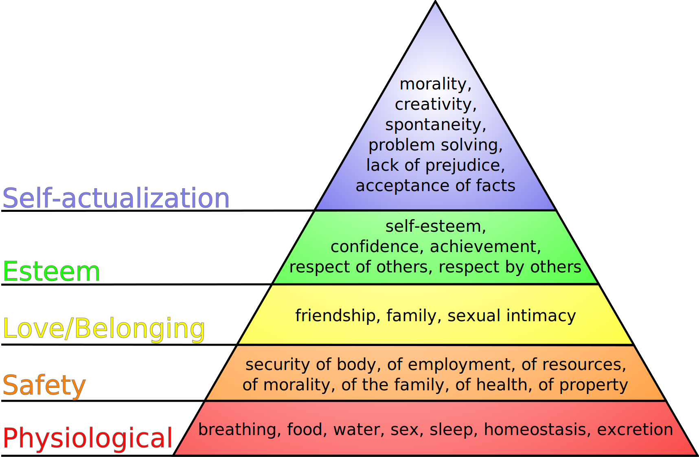

# Why I Don't Vote

If you are reading this, this piece is currently in a very loose draft state. And is mainly me trying to organise my own thinking and ideas and figure out if my ideas are justified or whether I've been horribly ignorant. With that in mind, please withhold judgement until it's finished.

---

A few years ago, deep into my London hipster vibe, I was reading a lot about self development and happiness 😀. I spent most of my time around East London, running a tech startup and going to the quirky bars where you sit on crates and barrels (to be fair I still do a lot of this now, it's fun but now I've also added on improvised comedy 🎭).

During this time I started an experiment. I stopped reading the news. I'd read about how the news doubles done on negativity to help sell, and that small doses of consistent negativity each day can have a dramatic long term effect on your happiness 😢. So time to find out if this was true... It was... I have never gone back to reading the news.

Turns out that I got all the information I needed to function in society just by the conversations I had with friends and family, along with the vague hints from the blogs and books I read. Unless you work in an industry where you need to know exactly what's going on in the world (for example, international spy 🕵️‍♂️), I can't see a compelling reason to go back. Reading the news just made me a slightly sadder Charlie and a wee bit more pessimistic on a daily basis, often in such subtle ways that I never realised until I cut it out for a few months.

I've heard that doing a similar thing with social media can improve peoples happiness as well, but to be honest I'm not that "down" with "the social medias" so I wouldn't notice much of a difference for me.

Up until this point (I was around 23 at the time 🐣), I hadn't voted yet. It was never something that really came up in my life or I had thought about until around then (oh how ignorance is bliss). But as I was living in London and getting older, I would hear more about politics, elections and all that crap 💩. Turns out conversations do get more serious as you get older.

I started thinking about it more, discussing this mad world of politics and voting with friends and family. To me it seemed ridiculous that people could vote without knowing a reasonable amount about all parties (not the fun kind of parties 🥳, I mean the boring political ones). Why don't we have an exam you need to pass in order to vote? I certainly didn't feel qualified enough to vote on who should run the country. I have since realised that democracy isn't about the electing the best people, but about keeping those in charge scared of the general public so they don't get all "dictatory". Democracy seems to be the best of a bunch of non ideal options.

I still hold the belief that my vote would be useless or counter productive if I didn't know an even amount about each reasonably sized party 🥳. Which ties us back into reading the news or finding other ways can I stay informed about the political parties without it effecting my happiness.

This was something I did not want to do, and had shown makes me happier when I don't. So now the question was:

> Is it worth reading the news and staying up to date, which decreases my daily happiness 😢, so that I feel informed enough to vote?

There's got to be a pretty good reason to vote to suffer those consequences. This led me to look at the problem in the following way:

- What is the problem that my vote will help to solve?
- How big of a problem is it?
- Will my vote help to solve that problem?
- What is the cost of voting?
- Overall is the benefit gained worth the consequences?

So let's look at these points in more detail.

## What is the problem that my vote will help to solve?

Errr...making a better world...duh!

Voting is about choosing who you think would make you (depending how selfless you are 😇), your country and by extension the world 🌍 better off compared to the other candidates. This could mean who will do less harm, as well as who will do most good. Either way the goal is the same, try and make yourself (again depending on 😇) and as many people as happy as possible.

It's always possible to improve the world. There's no cap on how awesome we can be, unless maybe we find a way to keep every living thing in a constant state of eternal happiness, even past the heat death of the universe 🔥.

## How big of a problem is it?

Making the world a better place is always an important problem. But as the world improves and becomes more equal the scale of the problem decreases 📉. When most people in the world are dying of hunger the problem is huge, when the problem shifts to most of the population being fed but don't have a great sense of love or belonging 💔, the problem is still important, but less urgent than it was before.

Maslow's Hierarchy of Needs is one place we can go to get a rough idea of the order of problems to solve for humanity. For a full breakdown of Maslow's Hierarchy of Needs go [here](https://en.wikipedia.org/wiki/Maslow's_hierarchy_of_needs) (or, you know...Google it), otherwise I'll assume you're somewhat familiar.

In a very loose sense I like to think of the size of each colour band in this triangle representing the relative importance of the problem compared to the others. For example it's more important to solve your physiological needs, like food 🍔, before solving your safety needs, like security of employment.

If you look at where the average human is on this scale over the last thousands of years we've been dramatically climbing this pyramid, getting more and more of the population up that pyramid. Looking at the last 10/20 years it's hard to see any trends. But when you look at the last 100/500 years, the world has been excelling in population well being (good job us 👏).

So although we can always make the world better, and it's super important to pull up people on the lower rungs of this pyramid, everything keeps getting better, so the scale of the problem is shrinking.

## Will my vote help to solve that problem?

In this section we look at what impact a vote actually has on making the country and world a better place. Politics 101: a vote is helping to choose a winner between the parties that have a chance in the election. Which means I should pick a party 🥳 that will result in a better world than the others. So far, so good 👍.

From what I can tell, the differences between all the parties likely to win an election are so small that the predicted net benefit to the world is the same regardless of who wins. We like to think that the parties are wildly different (😇 -> 😈), but on the grand scheme of dictators at one end and open anarchy at the other, all the parties in the election occupy a very tiny range on that spectrum.

It's like having a huge family dinner. Where your grandparents 👵🏻👴🏻 are cooking and are going to serve everyone the same meal, but let you all choose between 2 (each meal is the state of the world after the people you voted in have finished their term in office). It just so happens that these 2 meals are both your favourite 😋. I don't particular mind which one I have, they're different but both great. So I'll let everyone else at the table pick.

Now if we did get to a point where that range get's big enough that there would be a predictable difference in the net benefit to the world, that's when I'd come in to vote (In our dinner metaphor this is like a 3rd choice being something you like but not as much as the other 2 🤢). This is what happened during the Brexit vote, which is the one time I have voted, as I thought the world would be a better place if we were more together with each other 👫. And being a single issue it made it much easier to predict a net benefit to the world.

It's also pretty impossible to figure out what the net benefit will be of each major party 🥳 winning. Mixed in with the fact that the parties don't/can't always do what they promised, makes it more a game of trust and instinct than anything concrete.

So, will my vote help solve the problem? I don't think so when at the moment I can't see any way of reliably choosing which party will result in a better world than the other. Any of those parties likely to win are fine by me.

## What is the cost of voting?

In the intro to this post, I talked about an uninformed vote being pointless or worse case actually against what you're trying to achieve (by accidentally voting for a party that will do less good than the other party). So for an informed vote, you need to be informed (I know, pretty bold claim, right 🤪).

Reading the news isn't a great idea, we talked about it have a strong contribution to unhappiness 😢. But there are other ways to have an informed vote. You could specifically go to read non biased articles, manifestos and debates. Problem is, none of these are particularly fun either 👎. They all involve super boring topics and you'd need to go through quite a lot to get a good idea of what each major party stands for. All of this takes time.

When looking at the root problem of making the world a better place, I'd argue that the time I'd spend to stay informed would be better spent doing something else to improve the world. Even if that time goes towards earning more money so that you can give to charity. Or building products and companies that improve peoples lives. These are things that are more fun for me to do, and I think has a greater impact on the world.

## Overall, is the benefit gained worth the consequences?

I wrote this post to see if I'd change my mind by going through the argument. I still think that I can improve the world more by keeping myself happy 😀, giving to charity and building products and companies, rather than spending the time needed to have an informed vote. A happy Charlie, does better, more inspired work. And makes me have a better outlook on helping people.

The world of politics and voting comes with such a strong cost 💰, for something that (at the moment) you can't predict which party 🥳 will result in a better world. The major parties are all so similar on the grand scheme of things, the world is improving so much anyway and you really can't be sure what they'll do when voted in. So I really don't see a compelling reason to vote. I'm happy with any of the likely parties to win, the world still looks like it'll be amazing to me.

## Final thoughts

I'm not encouraging anyone to follow me on this. My reasoning only works because other people vote, getting rid of the bad parties and keeping the difference between the main parties so small.

If there was an organisation like [Effective Altruism](https://www.effectivealtruism.org/) (which is my favourite charity to give to) but they recommended who to vote for, I would totally vote on what they recommend. Having a bunch of trusted rationalists do all that research for you, and go further than 1 person could ever research would completely change my mind on this voting silliness 🤪.

Here are some of the core assumptions I had when writing this post. It would be useful for me to do more research to disprove/prove these, alas, there's only so much time I'll devote to this topic:

- The world is getting better (when looking at the trend over the last few hundred years)
- The added benefit to the world from either party winning is pretty much the same
- It's not possible to reliably pick a party who will have a better impact than the others (as the parties are so similar, don't always do what they say and the world is a complicated place)
- If it was possible to reliably pick a party who will have a better impact than the others:
  - The research time needed to reliably pick a party who will have a better impact than the others would have a bigger difference on the world being spent doing something else (such as earning more to give to charity, building products and companies that help the world)
  - Spending the time needed to reliably pick a party who will have a better impact than the others actively makes me unhappy
    - This one was tested through me stopping reading the news, and how I feel during political conversations. But could be tested more by finding different ways of staying informed.
