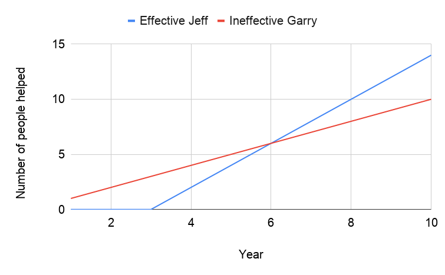

# How Selfish Should You Be 😇

Get ready 😉... As humans all we really want to do is increase our personal happiness. Helping others is just a way of satisfying our own goals. If you're in control of your actions, I don't think it's possible to be truly selfless.

But that doesn't mean we have to be selfish dicks 🍆 all the time. There are many aspects to helping others that can help you enjoy life more, either in the short or long term:

- That warm fuzzy 🐻 feeling of being a good person.
- Being seen and treated as a good person (be nice and people are more likely to be nice back).
- The more people we can bring out of poverty and help make happier 🙃, the more productive they can be in society. All of which helps us tackle the big issues like climate change, colonising other planets, and stalling death. Which definitely benefits yourself.

And a lot of activities that don't initially seem like they're directly helping people can end up having a big impact on others' lives:

- Building businesses that contribute to the economy, employ people, and up-skill them.
- Researching/developing new technology that may end up changing the lives of millions of people.
- Providing entertainment such as music or comedy 🤣 that improves the well being of many people's lives.

Especially when compared to students who spend a summer building mud shelters out in Africa whilst tweeting Lion King memes. Not the most effective way of helping people in a 3 month period, but I guess you have to start somewhere.

To be more effective at helping people you need to improve yourself and learn how to be more effective:

In this overly simplistic image we see the Effective Jeff spending 3 years not helping anyone but doing a lot of self development (possibly through working in startups, design, tech etc) and learning a lot. When Effective Jeff starts focussing on helping people in year 4, he quickly ends up helping more people than Ineffective Garry over the same 10 year period.

We also work better when we're happy, healthy, and motivated. Which means you'll help people in a more effective way. Everyone's a winner 🥳.

It's still important for some of us to directly help people. Being on the ground level, getting to know the real problems and feeding that back is super important. That's why we need a mixture of different types of help and different types of helpers, both direct and indirect.

So don't worry too much about the scale at which you're helping people. As long as you're not on either extreme of the scale; ensuring what you do isn't improving others or neglecting your own self development to build individual shelters somewhere. Then you're helping just fine.
